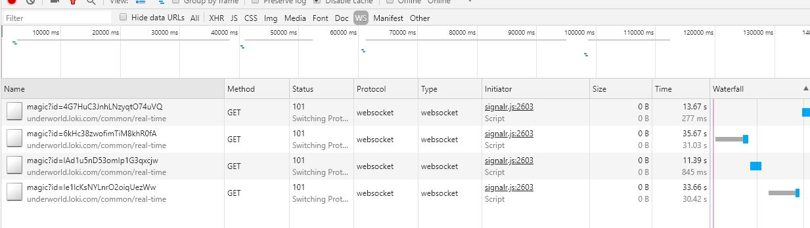

# SignalR Web Socket Connection - Issue on Clustering

## Error 
### Web Socket Connection - Get disconnected intermittent
I'm facing this issue that a connection is getting closed intermittently between 10sec~40sec. 

more info: https://github.com/aspnet/SignalR/issues/2411

## Test Application
* Open `index.html`
* Press `Connect`
* Notes: Manually you need to reconnect.

## Currently we are using:
* Signalr Javascript client : `1.0.0`
* Server-Side NuGet Packages: `1.0.0`
* Signalr Server is running on Kubernetes cluster of: `4 instances`
* Kubernetes: using `ingress with ngnix`
* Operating System on the Server: `Linux`
* Operating System on the Client: `Windows`
* Host: `AWS`
* Browser on the client: `Chrome`

## Additional Info
If you need additional info do not hesitate to contact me.

This sample was copied from [Signalr Official Samples](https://github.com/aspnet/SignalR/blob/dev/samples/SignalRSamples/wwwroot/streaming.html)

## Error Screenshot
 